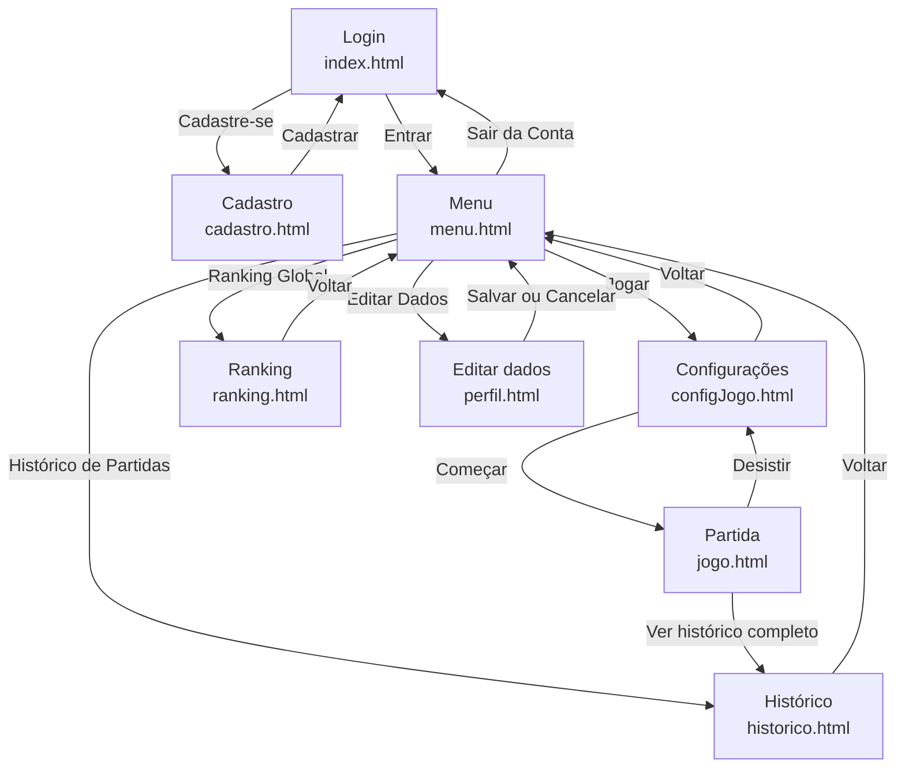

# 🐹 Jogo da Toupeira

Projeto Final de **SI401 – Programação para a Web** (FT-UNICAMP, 2º semestre de 2026), sob orientação do Prof. Guilherme Palermo Coelho.

Plataforma online do jogo **Acerte a Toupeira** (*Whac-a-Mole*), com cadastro e login de jogadores, partidas em duas modalidades (**Clássica** e **Explosiva**), histórico de partidas e ranking global.

**Site publicado:** https://prog-web-grupo04.vercel.app/

---

## 👥 Grupo 04

| Integrante | RA | Principais contribuições |
|---|---|---|
| João Guilherme Fernandes Frota | 222968 | Criação do repositório e administração do grupo; fluxo de telas e protótipo no Figma; telas de configurações do jogo, partida e edição de dados; testes e validação |
| Heitor Roberto Mesquita de Souza | 236168 | Diagramação do fluxo de telas e protótipo no Figma; telas de login, cadastro e menu |
| Cicero Eduardo Campos Leite dos Santos | 250984 | Apoio na organização do desenvolvimento; telas de histórico e ranking |
| Davi de Paula Garcia | 252508 | Revisão dos códigos e README |
| Henrique Carvalho De Mello | 241120 | README |

---

## 📌 Andamento do projeto

| Entrega | Escopo | Situação |
|---|---|---|
| **Parcial 1** | Front-end em HTML e CSS, versão **não funcional**: todas as páginas, formatação final e navegação final | ✅ Concluída |
| **Parcial 2** | Jogo funcional em JavaScript (sem back-end) | ⏳ Próxima etapa |
| **Parcial 3** | Back-end em PHP com MySQL/MariaDB: autenticação com sessões, histórico e ranking | ⏳ Planejada |

> **Parcial 1:** não há controle de acesso, jogo funcional nem armazenamento de dados. Nomes, pontuações, datas, tempo e tabuleiro são **valores e figuras fixas de exemplo**.

---

## 🗺️ Páginas e fluxo de navegação

| Página | Arquivo | Folha de estilo |
|---|---|---|
| Login (página inicial) | `index.html` | `style.css` |
| Cadastro | `cadastro.html` | `style.css` + `stylecadastro.css` |
| Menu principal | `menu.html` | `style.css` + `stylemenu.css` |
| Configurações da partida | `configJogo.html` | `style.css` + `styleconfigJogo.css` |
| Partida | `jogo.html` | `style.css` + `stylejogo.css` |
| Histórico de partidas | `historico.html` | `style.css` + `stylehistorico.css` |
| Ranking global | `ranking.html` | `style.css` + `styleranking.css` |
| Edição de dados do usuário | `perfil.html` | `style.css` + `stylecadastro.css` + `styleperfil.css` |



### Decisões de navegação

O enunciado permite variações de layout e navegação desde que justificadas. As escolhas do grupo foram:

- **Menu principal entre o login e as configurações.** Ele reúne Jogar, Histórico, Ranking e Edição de dados em um só lugar, em vez de espalhar esses links pela tela da partida.
- **Histórico em duas versões.** A página da partida mostra um resumo das últimas partidas; o histórico completo fica em página própria (`historico.html`), para não poluir a tela do jogo.

---

## 🗂️ Estrutura do projeto

```
.
├── index.html           # Login
├── cadastro.html
├── menu.html
├── configJogo.html
├── jogo.html
├── historico.html
├── ranking.html
├── perfil.html
├── style.css            # Base: fonte, fundo, botões, formulários
├── stylecadastro.css
├── stylemenu.css
├── styleconfigJogo.css
├── Stylejogo.css
├── stylehistorico.css
├── styleranking.css
├── Styleperfil.css
├── font/
│   └── Matcha.ttf
└── img/                 # Logos, fundo e mascote
```

---

## ▶️ Como executar

Nesta parcial **não é necessário servidor web**:

1. Clone o repositório (ou extraia o `.zip` mantendo as pastas):
   ```bash
   git clone https://github.com/johnnyg1212/ProgWeb-Grupo04.git
   ```
2. Abra o arquivo `index.html` em um navegador atual.
3. Navegue pelas telas usando os botões e links.

---

## ✅ Padrões e validação

- **HTML5** (`<!DOCTYPE html>`), com elementos semânticos e `lang="pt-BR"`, validado em [validator.w3.org](https://validator.w3.org/).
- **CSS** em folhas **externas** (uma base e uma por página), validado em [jigsaw.w3.org/css-validator](https://jigsaw.w3.org/css-validator/).
- **Nenhum template CSS** foi utilizado.
- Recursos de interface feitos **só com HTML e CSS**, sem JavaScript: menu do usuário (`<details>`), cartões de modalidade (`<input type="radio">` + `:checked`) e troca de tabela no ranking.
- Layout responsivo com `flexbox`, `grid` e `@media`.

---

## 🛠️ Tecnologias

| Etapa | Tecnologias |
|---|---|
| Parcial 1 (atual) | HTML5, CSS3 |
| Parcial 2 | JavaScript (front-end, eventos temporizados) |
| Parcial 3 | PHP (sem frameworks), MySQL ou MariaDB, sessões PHP |
| Apoio | Git e GitHub, Figma (protótipo), Vercel (publicação) |

---

## 🎨 Créditos e recursos externos

- **Fonte Matcha** (`font/Matcha.ttf`): https://www.dafont.com/matcha-2.font
- **Imagens** (`img/`): Imagens geradas no Gemini

---

*Projeto acadêmico desenvolvido para a disciplina SI401 – Programação para a Web, Faculdade de Tecnologia (FT) da UNICAMP.*