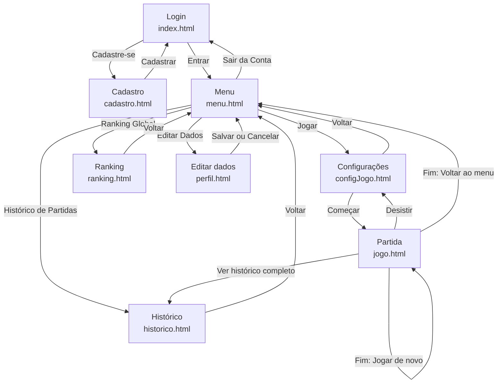

# 🐹 Jogo da Toupeira

Projeto Final de **Programação para a Web** (FT-UNICAMP, 2º semestre de 2026), sob orientação do Prof. Guilherme Palermo Coelho.

Plataforma online do jogo **Acerte a Toupeira** (*Whac-a-Mole*), com cadastro e login de jogadores, partidas em duas modalidades (**Clássica** e **Explosiva**), histórico de partidas e ranking global.

**Site publicado:** https://prog-web-grupo04.vercel.app/ <br>
**Parcial 1 - vídeo no YouTube:** https://www.youtube.com/watch?v=xYdes7JchXw <br>
**Parcial 2 - vídeo no YouTube:** https://youtu.be/QOVDdj5rpsw
[sada]()

---

## 👥 Grupo 04

| Integrante | RA | Parcial 1 | Parcial 2 |
|---|---|---|---|
| João Guilherme Fernandes Frota | 222968 | Criação do repositório e administração do grupo; fluxo de telas e protótipo no Figma; telas de configurações do jogo, partida e edição de dados; testes e validação | [preencher] |
| Heitor Roberto Mesquita de Souza | 236168 | Diagramação do fluxo de telas e protótipo no Figma; telas de login, cadastro e menu | [preencher] |
| Cicero Eduardo Campos Leite dos Santos | 250984 | Apoio na organização do desenvolvimento; telas de histórico e ranking | [preencher] |
| Davi de Paula Garcia | 252508 | Revisão dos códigos e README | [preencher] |
| Henrique Carvalho De Mello | 241120 | README | [preencher] |

---

## 📌 Andamento do projeto

| Entrega | Escopo | Situação |
|---|---|---|
| **Parcial 1** | Front-end em HTML e CSS, versão **não funcional**: todas as páginas, formatação final e navegação final | ✅ Concluída |
| **Parcial 2** | Dinâmica completa do jogo em JavaScript (sem back-end) | ✅ Concluída |
| **Parcial 3** | Back-end em PHP com MySQL/MariaDB: autenticação com sessões, histórico e ranking | ⏳ Planejada |

> **Parcial 2:** o jogo funciona por completo no navegador, mas **não há controle de acesso nem armazenamento de dados**. O histórico da página do jogo fica apenas na memória e some ao recarregar ou sair da página. As páginas de login, cadastro, ranking, histórico completo e edição de dados continuam com valores fixos de exemplo até a Parcial 3.

---

## 🎮 Como o jogo funciona

1. Na tela de **configurações**, o jogador escolhe a **modalidade** e as **dimensões do tabuleiro** (linhas × colunas, com **4 a 64 buracos no total**).
2. Na **partida**, toupeiras (e bombas, no modo Explosivo) surgem em buracos sorteados, **uma de cada vez**. O jogador clica nas toupeiras antes que elas se escondam.
3. Cada **nível dura 20 segundos**. No fim do nível, o jogo confere a porcentagem de acertos:
   - **passou:** começa o próximo nível, com toupeiras visíveis por menos tempo;
   - **não passou:** a partida termina e o jogador escolhe entre **Jogar de novo** e **Voltar ao menu**.
4. **Desistir** registra a partida parcial e volta para as configurações.

### Modalidades

| Modalidade | Regra |
|---|---|
| **Clássica** | Só aparecem toupeiras |
| **Explosiva** | Aparecem toupeiras e bombas (30% de chance). Clicar em uma bomba tira 1 ponto; ignorar a bomba não tem custo |

### Dificuldade e regras de nível

| Regra | Valor |
|---|---|
| Duração de cada nível | 20 s |
| Tempo visível de cada toupeira | 1,5 s no nível 1, cai 0,15 s por nível, com mínimo de 0,4 s |
| Acerto necessário para passar | 70% no nível 1, **+2 pontos por nível**, com **limite de 90%** |
| Porcentagem do nível | (toupeiras acertadas − bombas clicadas) ÷ toupeiras exibidas |
| Pontuação da partida | soma, nível a nível, de toupeiras acertadas − bombas clicadas (no modo Explosivo pode ser negativa) |
| Toupeira "exibida" | conta quando termina (acertada ou escondida). Nenhum alvo novo surge se não couber inteiro no tempo que resta do nível |

Todos esses valores ficam no começo do arquivo `js/jogo.js`.

### Informações exibidas durante a partida

Modalidade, nível, tempo restante, toupeiras acertadas, porcentagem de acertos no nível (com a porcentagem necessária) e pontuação. Abaixo do tabuleiro, a tabela **Suas partidas** lista as partidas encerradas na página (jogador, tabuleiro, modo, pontuação, nível e data/hora).

---

## 🗺️ Páginas e fluxo de navegação

| Página | Arquivo | Estilos | Script |
|---|---|---|---|
| Login (página inicial) | `index.html` | `style.css` | |
| Cadastro | `cadastro.html` | `style.css` + `stylecadastro.css` | |
| Menu principal | `menu.html` | `style.css` + `stylemenu.css` | |
| Configurações da partida | `configJogo.html` | `style.css` + `styleconfigJogo.css` | `configurar.js` |
| Partida | `jogo.html` | `style.css` + `stylejogo.css` | `jogo.js` |
| Histórico de partidas | `historico.html` | `style.css` + `stylehistorico.css` | |
| Ranking global | `ranking.html` | `style.css` + `styleranking.css` | |
| Edição de dados do usuário | `perfil.html` | `style.css` + `stylecadastro.css` + `styleperfil.css` | |


```mermaid
flowchart TD
    login["Login<br>index.html"]
    cadastro["Cadastro<br>cadastro.html"]
    menu["Menu<br>menu.html"]
    config["Configurações<br>configJogo.html"]
    jogo["Partida<br>jogo.html"]
    historico["Histórico<br>historico.html"]
    ranking["Ranking<br>ranking.html"]
    perfil["Editar dados<br>perfil.html"]

    login -->|Entrar| menu
    login -->|Cadastre-se| cadastro
    cadastro -->|Cadastrar| login
    menu -->|Jogar| config
    menu -->|Histórico de Partidas| historico
    menu -->|Ranking Global| ranking
    menu -->|Editar Dados| perfil
    menu -->|Sair da Conta| login
    config -->|Começar| jogo
    config -->|Voltar| menu
    jogo -->|Desistir| config
    jogo -->|Fim: Jogar de novo| jogo
    jogo -->|Fim: Voltar ao menu| menu
    jogo -->|Ver histórico completo| historico
    historico -->|Voltar| menu
    ranking -->|Voltar| menu
    perfil -->|Salvar ou Cancelar| menu
```

### Decisões de navegação

- **Menu principal entre o login e as configurações:** reúne Jogar, Histórico, Ranking e Edição de dados em um só lugar.
- **Histórico em duas versões:** a página da partida mostra as partidas jogadas naquela página; o histórico completo fica em página própria (`historico.html`).
- **Configurações passam para o jogo pela URL:** o formulário envia por GET (`jogo.html?modo=classico&linhas=4&colunas=4`) e o jogo lê esses valores. Se a URL tiver valores inválidos, o jogo volta para as configurações.

---

## 🧩 Como o JavaScript está organizado

| Arquivo | Responsabilidade |
|---|---|
| `js/configurar.js` | Valida o tamanho do tabuleiro (4 a 64 buracos no total) antes de abrir a partida |
| `js/jogo.js` | Estado, regras, tabuleiro, timers, cliques, níveis, fim de partida e histórico da página |

Pontos principais de `jogo.js`:

- **Tabuleiro:** os buracos (`<button>`) são criados pelo JavaScript a partir de linhas × colunas. O número de colunas e o tamanho do buraco vão para o CSS por variáveis (`--colunas` e `--tam`).
- **Cliques:** um único ouvinte no tabuleiro (delegação de eventos) trata acerto de toupeira, clique em bomba e buraco vazio.
- **Estilo pelo CSS:** o JavaScript só liga e desliga classes (`tem-toupeira`, `tem-bomba`, `acerto`, `erro-bomba`); a aparência fica no `stylejogo.css`.
- **Timers:** um relógio (`setInterval`, a cada 100 ms) que calcula o tempo restante pelo horário do computador; uma cadeia de `setTimeout` para as aparições; e um `setTimeout` por alvo para escondê-lo. Todos são cancelados ao fim da partida, ao desistir e ao sair da página.
- **Vitória e derrota:** ao fim de cada nível, `encerrarNivel` compara a porcentagem do nível com o mínimo exigido. Quem não atinge o mínimo encerra a partida.
- **Fim de partida:** usa o elemento `<dialog>` com as opções "Jogar de novo" e "Voltar ao menu".

---

## 🗂️ Estrutura do projeto

```
.
├── index.html
├── cadastro.html
├── menu.html
├── configJogo.html
├── jogo.html
├── historico.html
├── ranking.html
├── perfil.html
├── css/
│   ├── style.css            # Base: fonte, fundo, botões, formulários
│   ├── stylecadastro.css
│   ├── stylemenu.css
│   ├── styleconfigJogo.css
│   ├── stylejogo.css
│   ├── stylehistorico.css
│   ├── styleranking.css
│   └── styleperfil.css
├── js/
│   ├── configurar.js
│   └── jogo.js
├── font/
│   └── Matcha.ttf
└── img/                     # Logos, fundo e mascote
```

---

## ▶️ Como executar

Não é necessário servidor web:

1. Clone o repositório (ou extraia o `.zip` mantendo as pastas):
   ```bash
   git clone https://github.com/johnnyg1212/ProgWeb-Grupo04.git
   ```
2. Abra o arquivo `index.html` em um navegador atual.
3. Faça login (qualquer valor, nesta parcial), vá em **Jogar**, escolha a modalidade e o tabuleiro e clique em **Começar**.

### Como testar o jogo

| Teste | Resultado esperado |
|---|---|
| Em Configurações, informar 1 × 3 ou 1 × 80 | Mensagem de erro e a partida não abre |
| Abrir `jogo.html` sem parâmetros na URL | Volta para as configurações |
| Jogar clicando em todas as toupeiras | Passa de nível; a meta sobe de 70% para 72%, 74%... até parar em 90% |
| Jogar sem clicar | Ao fim do nível, a partida termina e a janela de fim aparece |
| Modo Explosivo: clicar em bombas | A pontuação diminui 1 por bomba |
| "Jogar de novo" | Zera nível, pontuação e acertos, e a nova partida aparece na tabela |
| **Desistir** | Volta para as configurações |
| Tabuleiros 2 × 2, 8 × 8 e 1 × 64 | Os buracos aparecem; o 1 × 64 rola na horizontal |

---

## ✅ Padrões e validação

- **HTML5** (`<!DOCTYPE html>`), com elementos semânticos, validado em [validator.w3.org](https://validator.w3.org/).
- **CSS** em folhas **externas** (uma base e uma por página), validado em [jigsaw.w3.org/css-validator](https://jigsaw.w3.org/css-validator/).
- **JavaScript** em arquivos externos (`js/`), sem bibliotecas.
- **Nenhum template CSS** foi utilizado.
- Recursos de interface feitos **só com HTML e CSS**: menu do usuário (`<details>`), cartões de modalidade (`<input type="radio">` + `:checked`) e troca de tabela no ranking.
- Layout responsivo com `flexbox`, `grid` e `@media`.

---

## 🛠️ Tecnologias

| Etapa | Tecnologias |
|---|---|
| Parcial 1 | HTML5, CSS3 |
| Parcial 2 | JavaScript (DOM, eventos, `setTimeout` e `setInterval`, `<dialog>`) |
| Parcial 3 (planejada) | PHP (sem frameworks), MySQL ou MariaDB, sessões PHP |
| Apoio | Git e GitHub, Figma (protótipo), Vercel (publicação) |

---

## 🎨 Créditos e recursos externos

- **Fonte Matcha** (`font/Matcha.ttf`): https://www.dafont.com/matcha-2.font
- **Imagens** (`img/`): imagens geradas no Gemini

---

*Projeto acadêmico desenvolvido para a disciplina Programação para a Web, Faculdade de Tecnologia (FT) da UNICAMP.*
